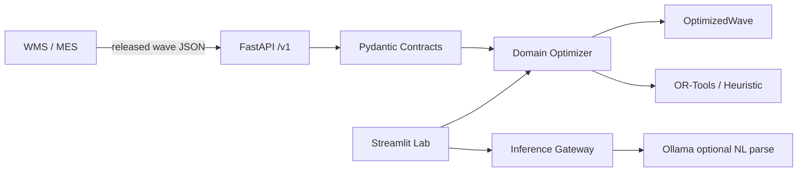

# PickAI

PickAI is a **WMS-adjacent pick-path optimization service**: your warehouse management system sends released wave lines, PickAI returns an optimized pick travel sequence. It is **not** a WMS. Inventory, order release, confirmations, and picker mobile UI stay in the WMS you already run.

Built on Samir Saci's MIT-licensed [picking-route](https://github.com/samirsaci/picking-route) simulation work, extended for integration, floor constraints, and optional local NL control.

## What PickAI is

| Your WMS owns | PickAI owns |
|---|---|
| Inventory, locations master, order release | Route optimization for released waves |
| Pick task creation and confirmation | Ordered stop sequence + ladder/equipment math |
| RF / mobile UI on the floor | REST API + Streamlit lab console |

**Typical integration:** WMS exports wave JSON → `POST /v1/waves/optimize` → apply returned sequence to pick-task ordering or route preview.

## Evolved from picking-route

| [picking-route](https://github.com/samirsaci/picking-route) | PickAI |
|---|---|
| Streamlit simulation only | FastAPI `/v1` + Streamlit + Docker Compose |
| CSV upload in UI | WMS JSON optimize, CSV import, webhook stub, [samples pack](samples/README.md) |
| Heuristic routing only | OR-Tools default + heuristic fallback (`PICKAI_SOLVER`) |
| 2D (x, y) distance | 2.5D level/z, ladder relocate, aisle-lock — see [routing model](docs/routing-model.md) |
| Starts at depot | Ladder/start position; `ladder_state_after` in API response |
| Walker implied | Walker vs forklift profiles, one-way aisles, turn penalties |
| No timing metadata | `processing_time_ms`, `estimated_picker_time_saved_s` |
| Sample CSV only | Mendeley adapter, fixtures, [HF synthetic dataset](https://huggingface.co/datasets/MuhibBeekun/pickai-synthetic-nl-parse-v1) |
| No tests / CI | pytest, verify script, GitHub Actions |
| No NL layer | Optional Ollama chat → validated constraints (solver still computes routes) |

Attribution: [NOTICE.md](NOTICE.md)

## What the AI layer adds (optional)

The **optimizer runs without any LLM**. Ollama is only for the Streamlit chat path.

When enabled, a local model parses supervisor language into validated constraint JSON (equipment mode, ladder position, aisle rules). Pydantic validation and bounded retries run before the solver. **OR-Tools or the heuristic engine computes all distances and tour order.**

Base `qwen2.5:7b-instruct` via Ollama reached 99.33% aggregate field match on 100 held-out examples. LoRA fine-tune did not beat the baseline — see [fine-tune eval](docs/fine-tune-eval.md).

## Hugging Face artifacts

Public ML artifacts for reproducibility (optional; not required to run Docker or the API):

| Artifact | Link | Notes |
| --- | --- | --- |
| Synthetic NL dataset | [pickai-synthetic-nl-parse-v1](https://huggingface.co/datasets/MuhibBeekun/pickai-synthetic-nl-parse-v1) | ~3k rows; optimizer ground-truth constraints |
| Experimental LoRA | [pickai-qwen2.5-7b-nl-parse-lora](https://huggingface.co/MuhibBeekun/pickai-qwen2.5-7b-nl-parse-lora) | Value gate failed; documented honestly |

Canonical model/dataset cards live in [`docs/huggingface-lora-model-card.md`](docs/huggingface-lora-model-card.md) and [`docs/huggingface-dataset-card.md`](docs/huggingface-dataset-card.md).

## 30-second overview

You send order lines and routing constraints. PickAI returns an ordered travel sequence with explicit pick and ladder-relocate steps, plus total distance and duration.

Responses also include `ladder_state_after`, `processing_time_ms`, and `estimated_picker_time_saved_s` for state persistence and KPI reporting.

## Quickstart (Docker-first)

1. Copy env file:

```powershell
Copy-Item .env.example .env
```

2. (Optional) Run Ollama on host for chat only — pull model:

```powershell
$env:CUDA_DEVICE_ORDER='PCI_BUS_ID'
$env:CUDA_VISIBLE_DEVICES='0'
ollama pull qwen2.5:7b-instruct
```

3. Start PickAI services:

```powershell
docker compose up -d --build
```

4. Open:

- API docs: http://localhost:8000/docs
- Streamlit: http://localhost:8501

## 5-minute operator walkthrough

1. Start services with `docker compose up`.
2. Open Streamlit and select the Mendeley dataset or upload `samples/order_lines_minimal.csv`.
3. Set equipment mode and ladder constraints in the sidebar.
4. Run Simulation 1.
5. Review route segments and total distance.

## API-first WMS integration

Primary integration endpoint:

- `POST /v1/waves/optimize`

Then poll:

- `GET /v1/runs/{run_id}`

CSV fallback:

- `POST /v1/imports/csv`

Webhook stub:

- `POST /v1/webhooks/wms`

Full guide: [docs/wms-integration-guide.md](docs/wms-integration-guide.md)

Agent-call schema: [docs/tool-schema-compute_optimal_pick_path.json](docs/tool-schema-compute_optimal_pick_path.json)

## Samples

See [samples/README.md](samples/README.md) and:

- `samples/order_lines_minimal.csv`
- `samples/order_lines_with_aisles.csv`
- `samples/location_master.csv`
- `samples/expected_optimize_request.json`

## Architecture



## What this is for

- Warehouse engineering simulation
- WMS integration prototypes
- Route policy comparison (walker vs forklift)

## What this is not for

- Inventory master data sync
- WMS writeback / orchestration ownership
- Real-time robotics control
- Replacing your WMS mobile RF client

## Future steps (roadmap, not shipped)

- **Voice input (Whisper):** speech → text → existing NL parser → same solver (hands-free supervisor constraints)
- **Mobile shell:** route preview / supervisor chat app; production picking still via WMS RF
- **Vendor WMS connectors:** packaged adapters on top of `/v1`
- **Stronger ladder-position NL parsing:** improved synthetic data and eval for `start_position`
- **Async optimize + webhook:** large waves with callback instead of poll-only

## Verification commands

```powershell
./scripts/preflight.ps1
python -m pytest tests -q
python scripts/verify_optimize_trace.py --fixture data/fixtures/mendeley_sample.csv --mode walker
uvicorn pickai.api.main:app --port 8000
streamlit run app.py
```

## Fine-tuned chat (optional)

Fine-tune artifacts are value-gated. See [docs/fine-tune-eval.md](docs/fine-tune-eval.md).

- Default release path: runtime stays on base `qwen2.5:7b-instruct` via Ollama.
- Optional local adapter path: set `PICKAI_USE_LORA=1` and keep `outputs/lora` available.
- Current eval state: LoRA underperformed base on 100-example holdout (17.67% vs 99.33% aggregate).
- Hugging Face artifacts (optional, not required for startup):
  - Dataset: https://huggingface.co/datasets/MuhibBeekun/pickai-synthetic-nl-parse-v1
  - Experimental LoRA: https://huggingface.co/MuhibBeekun/pickai-qwen2.5-7b-nl-parse-lora

## License and attribution

This project is MIT licensed.

- Original source: [samirsaci/picking-route](https://github.com/samirsaci/picking-route) (MIT)
- Attribution maintained in [NOTICE.md](NOTICE.md)
- Original theory and articles by Samir Saci are linked in upstream documentation.
