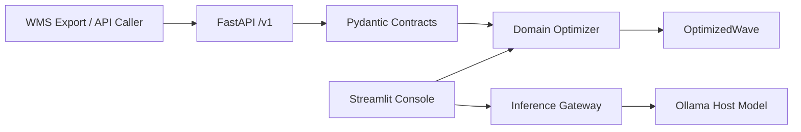

# PickAI

PickAI is a warehouse picking-route optimization platform that extends the original picking-route project by Samir Saci with:

- REST API for WMS integration
- Equipment-aware and ladder-aware routing
- Streamlit operator console with route visualization
- Synthetic NL dataset generation and optional local LLM parsing

## 30-second overview

You send order lines and routing constraints. PickAI returns an ordered travel sequence with explicit pick and ladder-relocate steps, plus total distance and duration.

## Quickstart (Docker-first)

1. Copy env file:

```powershell
Copy-Item .env.example .env
```

2. (Recommended) Run Ollama on host and pull model:

```powershell
$env:CUDA_VISIBLE_DEVICES='0'
ollama pull qwen2.5:7b-instruct
```

3. Start PickAI services:

```powershell
docker compose up -d --build
```

4. Open:

- API docs: http://localhost:8000/docs
- Streamlit: http://localhost:8501

## 5-minute operator walkthrough

1. Start services with `docker compose up`.
2. Open Streamlit and select the Mendeley dataset or upload `samples/order_lines_minimal.csv`.
3. Set equipment mode and ladder constraints in the sidebar.
4. Run Simulation 1.
5. Review route segments and total distance.

## API-first WMS integration

Primary integration endpoint:

- `POST /v1/waves/optimize`

Then poll:

- `GET /v1/runs/{run_id}`

CSV fallback:

- `POST /v1/imports/csv`

Webhook stub:

- `POST /v1/webhooks/wms`

Full guide: `docs/wms-integration-guide.md`

## Samples

See `samples/README.md` and:

- `samples/order_lines_minimal.csv`
- `samples/order_lines_with_aisles.csv`
- `samples/location_master.csv`
- `samples/expected_optimize_request.json`

## Architecture



## What this is for

- Warehouse engineering simulation
- WMS integration prototypes
- Route policy comparison (walker vs forklift)

## What this is not for

- Inventory master data sync
- WMS writeback/orchestration ownership
- Real-time robotics control

## Verification commands

```powershell
./scripts/preflight.ps1
python -m pytest tests -q
python scripts/verify_optimize_trace.py --fixture data/fixtures/mendeley_sample.csv --mode walker
uvicorn pickai.api.main:app --port 8000
streamlit run app.py
```

## Fine-tuned chat (optional)

Fine-tune artifacts are value-gated. See `docs/fine-tune-eval.md`.

- If value gate passes: set `HF_LORA_REPO` and upload LoRA.
- If value gate fails: runtime stays on base model (valid release path).

## License and attribution

This project is MIT licensed.

- Original source: samirsaci/picking-route (MIT)
- Attribution maintained in `NOTICE.md`
- Original theory and articles by Samir Saci are linked in upstream documentation.
