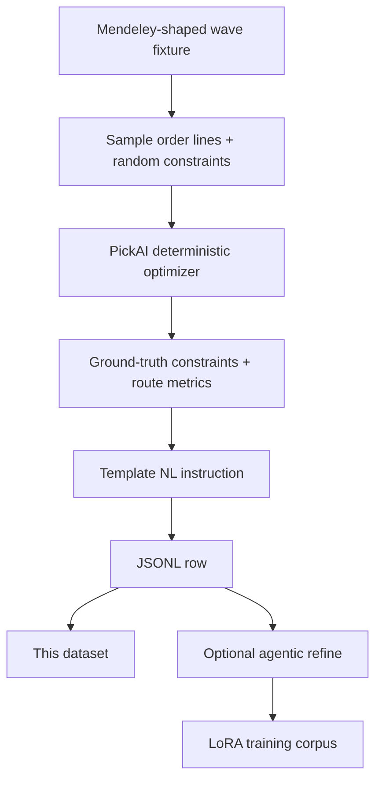

# PickAI Synthetic NL Parse v1

Synthetic instruction dataset for mapping warehouse supervisor natural language into **PickAI `OptimizeConstraints` JSON**. Each row pairs an operator-style instruction with ground-truth constraint fields produced by the **deterministic PickAI optimizer**, not hand-labeled guesses.

Part of [PickAI](https://github.com/Muhib-Beekun/pickai), an open-source WMS-adjacent pick-path optimization service.

**Related model (experimental LoRA, value gate failed):** [MuhibBeekun/pickai-qwen2.5-7b-nl-parse-lora](https://huggingface.co/MuhibBeekun/pickai-qwen2.5-7b-nl-parse-lora)

---

## Dataset summary

| | |
| --- | --- |
| **Rows (full)** | ~3,050 JSONL lines |
| **Committed sample** | 50 rows in [GitHub `sample.jsonl`](https://github.com/Muhib-Beekun/pickai/blob/main/data/synthetic/sample.jsonl) |
| **Language** | English |
| **Domain** | Warehouse order picking, WMS routing constraints |
| **Label source** | Deterministic optimizer over sampled Mendeley-shaped wave fixtures |
| **License** | MIT |

**Distribution (full synthetic set, 3,000 rows before refine merge)**

| Field | Walker | Forklift |
| --- | ---: | ---: |
| `equipment_mode` | 1,490 | 1,510 |

| `ladder_must_stay_in_aisle` | True | False |
| --- | ---: | ---: |
| Count | 1,515 | 1,485 |

---

## Quick load

```python
from datasets import load_dataset

# Full JSONL on the Hub
ds = load_dataset(
    "MuhibBeekun/pickai-synthetic-nl-parse-v1",
    data_files="synthetic_nl_parse.jsonl",
    split="train",
)

# 50-row public sample (same schema)
sample = load_dataset(
    "MuhibBeekun/pickai-synthetic-nl-parse-v1",
    data_files="sample.jsonl",
    split="train",
)

print(ds[0]["instruction"][:120])
print(ds[0]["output"]["constraints"])
```

Local generation (reproduce from source):

```powershell
git clone https://github.com/Muhib-Beekun/pickai.git
cd pickai
python scripts/generate_synthetic_jsonl.py
python scripts/agentic_nl_refine.py   # optional: adds refined rows
```

---

## Data instances

Each JSONL line is one object:

```json
{
  "instruction": "Optimize a wave with 11 lines using walker. Start at aisle A8 level 2, x=7.0, y=20.0, and ladder must stay in aisle.",
  "input": {
    "orders": 7,
    "lines": 11,
    "x_min": 7.0,
    "x_max": 7.0,
    "y_min": 7.0,
    "y_max": 42.0
  },
  "output": {
    "constraints": {
      "ladder_must_stay_in_aisle": true,
      "equipment_mode": "walker",
      "start_position": {
        "aisle": "A8",
        "level": "2",
        "x": 7.0,
        "y": 20.0
      },
      "depot": null
    },
    "expected": {
      "total_distance_m": 74.0,
      "total_duration_s": 104.86,
      "ladder_state_after": {
        "aisle": "A8",
        "level": "3",
        "x": 7.0,
        "y": 42.0
      }
    }
  }
}
```

The **`output.constraints`** block is the training target for NL parsers. The **`output.expected`** block holds optimizer metrics for audit; parsers should not invent routes from it.

---

## Data fields

| Field | Type | Description |
| --- | --- | --- |
| `instruction` | string | Natural-language supervisor request |
| `input` | object | Wave summary context (order count, line count, coordinate bounds) |
| `output.constraints` | object | Ground-truth `OptimizeConstraints` JSON |
| `output.constraints.equipment_mode` | `"walker"` \| `"forklift"` | Equipment profile for routing |
| `output.constraints.ladder_must_stay_in_aisle` | boolean | Hard aisle-lock constraint |
| `output.constraints.start_position` | object | Ladder start `{ aisle, level, x, y }` |
| `output.constraints.depot` | object \| null | Optional depot override |
| `output.expected` | object | Optimizer distance/duration/ladder state after run |

Full schema: [PickAI contracts](https://github.com/Muhib-Beekun/pickai/blob/main/pickai/contracts/types.py).

---

## Splits and usage

| Split | File | Rows | Purpose |
| --- | --- | ---: | --- |
| **train (default)** | `synthetic_nl_parse.jsonl` | ~3,000 | Primary synthetic corpus |
| **refined (repo-local)** | `refined_nl_parse.jsonl` | 66 | Agentic refine pass; merged into LoRA training (3,066 total) |
| **sample** | `sample.jsonl` | 50 | Public preview; committed on GitHub |
| **eval holdout** | local only | 100 | Deterministic hash split; see `scripts/eval_nl_parse.py` |

Recommended: treat **`output.constraints`** as the supervised target. Hold out 100+ rows before training; do not evaluate on training phrasing alone.

---

## How it was built



1. **Sample** wave lines from committed Mendeley-style fixtures.
2. **Draw** random `OptimizeConstraints` (equipment, ladder lock, start position).
3. **Run** the PickAI optimizer to produce route metrics and validate feasibility.
4. **Emit** a template instruction describing the same constraints.
5. **Optional refine:** [`agentic_nl_refine.py`](https://github.com/Muhib-Beekun/pickai/blob/main/scripts/agentic_nl_refine.py) runs writer + Pydantic validator cycles; 66/200 held-out rows passed and were added to LoRA training.

**Important lineage note:** bulk synthetic generation uses the **heuristic solver** for speed (~3k rows). Runtime PickAI defaults to **OR-Tools**. Labels are constraint JSON, not tour order. See [data lineage](https://github.com/Muhib-Beekun/pickai/blob/main/docs/data-lineage.md).

---

## Intended use

- Fine-tuning or evaluating NL → structured constraint parsers for warehouse ops
- Research on domain-specific instruction tuning with deterministic ground truth
- Reproducing PickAI Phase 2 LoRA experiments

## Out-of-scope use

- Training route optimizers (tour order is not the label)
- Replacing a WMS or inventory system
- Production deployment without held-out eval on your phrasing

---

## Evaluation context

Holdout: 100 rows via deterministic hash split (not tail rows). Prompt format shared with training via `pickai/inference/nl_parse_prompt.py`.

**Parity pass (prompt-aligned, June 2026):** base [Qwen2.5-7B-Instruct](https://huggingface.co/Qwen/Qwen2.5-7B-Instruct) via Ollama **100.00%** aggregate; LoRA **44.67%** (up from 17.67% before prompt alignment). Value gate failed. See [fine-tune eval](https://github.com/Muhib-Beekun/pickai/blob/main/docs/fine-tune-eval.md) and the [model card](https://huggingface.co/MuhibBeekun/pickai-qwen2.5-7b-nl-parse-lora).

Known gap: **`start_position`** / ladder fields remain the main failure mode in agentic refine (134/200 rows rejected).

---

## Related links

| Resource | URL |
| --- | --- |
| PickAI (GitHub) | https://github.com/Muhib-Beekun/pickai |
| LoRA model card | https://huggingface.co/MuhibBeekun/pickai-qwen2.5-7b-nl-parse-lora |
| Data lineage | https://github.com/Muhib-Beekun/pickai/blob/main/docs/data-lineage.md |
| Generator script | https://github.com/Muhib-Beekun/pickai/blob/main/scripts/generate_synthetic_jsonl.py |
| Upstream inspiration | https://github.com/samirsaci/picking-route |

---

## License

MIT. Upstream [picking-route](https://github.com/samirsaci/picking-route) attribution preserved in [NOTICE.md](https://github.com/Muhib-Beekun/pickai/blob/main/NOTICE.md). No customer WMS data included.
