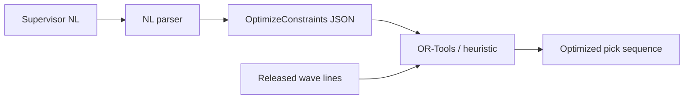

# PickAI NL Parse LoRA

**Status: experimental · value gate failed · not the PickAI default runtime**

LoRA adapter for [PickAI](https://github.com/Muhib-Beekun/pickai), an open-source WMS-adjacent pick-path optimization service. The adapter maps warehouse supervisor natural language into validated `OptimizeConstraints` JSON (equipment mode, ladder position, aisle rules). PickAI's release runtime stays on base [Qwen2.5-7B-Instruct](https://huggingface.co/Qwen/Qwen2.5-7B-Instruct) via Ollama because this adapter **regressed** on held-out evaluation.

Published for reproducibility and learning, not production promotion.

---

## Overview

PickAI separates **constraint parsing** from **route optimization**. A language model (optional) turns operator instructions into JSON constraints. OR-Tools or a heuristic engine computes the actual pick sequence. This repository holds the PEFT LoRA weights from a bounded fine-tune experiment on synthetic warehouse NL data.



**What this adapter targets**

| Field | Type | Example intent |
| --- | --- | --- |
| `equipment_mode` | `walker` \| `forklift` | "Use forklift mode for this wave" |
| `ladder_must_stay_in_aisle` | boolean | "Keep the ladder in aisle 3" |
| `start_position` | `{ aisle, level, x, y }` | "Start at aisle B, level 2" |
| `depot` | `{ aisle, level, x, y }` | Optional depot override |

Full schema: [PickAI contracts](https://github.com/Muhib-Beekun/pickai/blob/main/pickai/contracts/types.py).

---

## Recommended use

| Use case | Recommendation |
| --- | --- |
| PickAI production / Docker default | **Base Qwen via Ollama** (99.33% held-out aggregate) |
| Research on warehouse NL → structured constraints | Load this adapter with PEFT for experimentation |
| Route optimization | **Do not use this adapter** — use PickAI's deterministic solver |

---

## Training

| Setting | Value |
| --- | --- |
| Base model | [Qwen/Qwen2.5-7B-Instruct](https://huggingface.co/Qwen/Qwen2.5-7B-Instruct) |
| Method | PEFT LoRA |
| Rank (`r`) | 16 |
| LoRA alpha | 32 |
| LoRA dropout | 0.05 |
| Target modules | `q_proj`, `k_proj`, `v_proj`, `o_proj` |
| Training rows | 3,066 (synthetic + agentic-refined JSONL) |
| Max steps | 100 (bounded run; early stop before full epoch) |
| Batch size | 1 × gradient accumulation 8 |
| Learning rate | 2e-4 (linear decay) |
| Precision | fp16 |
| GPU | NVIDIA GeForce RTX 3090 |
| Dataset | [MuhibBeekun/pickai-synthetic-nl-parse-v1](https://huggingface.co/datasets/MuhibBeekun/pickai-synthetic-nl-parse-v1) |

**Training loss (logged every 10 steps)**

| Step | Loss |
| ---: | ---: |
| 10 | 2.155 |
| 20 | 0.220 |
| 30 | 0.103 |
| 40 | 0.038 |
| 50 | 0.026 |
| 60 | 0.022 |
| 70 | 0.018 |
| 80 | 0.018 |
| 90 | 0.017 |
| 100 | 0.018 |

Training loss dropped sharply while held-out field accuracy collapsed — a classic overfit / train-inference mismatch signal.

Training script: [`scripts/train_lora_nl_parse.py`](https://github.com/Muhib-Beekun/pickai/blob/main/scripts/train_lora_nl_parse.py)

---

## Evaluation

100 held-out examples from the synthetic dataset. Scoring: exact field match on `equipment_mode`, `start_position`, and `ladder_must_stay_in_aisle` after JSON parse.

| Metric | Base (Ollama) | This LoRA |
| --- | ---: | ---: |
| **Aggregate field match** | **99.33%** | **17.67%** |
| Equipment mode | 98.00% | 0.00% |
| Ladder position | 100.00% | 0.00% |
| Aisle constraint | 100.00% | 53.00% |

**Value gate: failed.** PickAI does not enable this adapter by default.

Full write-up: [docs/fine-tune-eval.md](https://github.com/Muhib-Beekun/pickai/blob/main/docs/fine-tune-eval.md)

**Likely causes (working hypotheses)**

- Base Qwen via Ollama was already near ceiling before training
- Fine-tune prompt format differs from Ollama chat inference at runtime
- Synthetic phrasing overfit; ladder `start_position` underrepresented in refined subset (66/200 retained)

---

## Load locally (PEFT)

Requires `transformers`, `peft`, `torch`, and the base model weights from Hugging Face.

```python
import torch
from peft import PeftModel
from transformers import AutoModelForCausalLM, AutoTokenizer

base = "Qwen/Qwen2.5-7B-Instruct"
adapter = "MuhibBeekun/pickai-qwen2.5-7b-nl-parse-lora"

tokenizer = AutoTokenizer.from_pretrained(base, trust_remote_code=True)
model = AutoModelForCausalLM.from_pretrained(
    base,
    torch_dtype=torch.float16,
    device_map="auto",
    trust_remote_code=True,
)
model = PeftModel.from_pretrained(model, adapter)
model.eval()
```

Example prompt format (matches training):

```python
prompt = (
    "Instruction:\nUse forklift mode and keep the ladder in aisle 3.\n\n"
    "Input:\n{\"wave_id\": \"W-001\", \"line_count\": 12}\n\n"
    "Output:\n"
)
inputs = tokenizer(prompt, return_tensors="pt").to(model.device)
out = model.generate(**inputs, max_new_tokens=256)
print(tokenizer.decode(out[0], skip_special_tokens=True))
```

---

## PickAI integration (optional)

PickAI ships with base Ollama parsing. To experiment with this adapter inside the repo:

```powershell
git clone https://github.com/Muhib-Beekun/pickai.git
cd pickai
# train or download adapter into outputs/lora
$env:PICKAI_USE_LORA = "1"
$env:PICKAI_LOCAL_LORA_DIR = "outputs/lora"
docker compose up -d --build
```

Re-evaluate before relying on it:

```powershell
python scripts/eval_nl_parse.py --lora-path outputs/lora
```

---

## Related links

| Resource | URL |
| --- | --- |
| PickAI (GitHub) | https://github.com/Muhib-Beekun/pickai |
| Training dataset | https://huggingface.co/datasets/MuhibBeekun/pickai-synthetic-nl-parse-v1 |
| Fine-tune evaluation | https://github.com/Muhib-Beekun/pickai/blob/main/docs/fine-tune-eval.md |
| WMS integration guide | https://github.com/Muhib-Beekun/pickai/blob/main/docs/wms-integration-guide.md |
| Upstream inspiration | https://github.com/samirsaci/picking-route |

---

## License

MIT. See [PickAI LICENSE](https://github.com/Muhib-Beekun/pickai/blob/main/LICENSE) and upstream [picking-route](https://github.com/samirsaci/picking-route) attribution in [NOTICE.md](https://github.com/Muhib-Beekun/pickai/blob/main/NOTICE.md).
